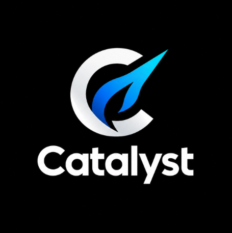

# Catalyst

## Project and release artifacts

- [Classroom Presentation Randomizer — live app](https://randomizer-weld-one.vercel.app)
- [Application code repository](https://github.com/OliviaY1/randomizer)
- [A3 cloud architecture and deployment](rapid-mvp/architecture/README.md), including current completion status
- [A2 critical user journey audit](rapid-mvp/cuj/README.md)
- [Team profiles and responsibilities](team/profiles.md)
- [Working principles](team/principles.md), [tools and workflow](team/tooling.md), and [diversity/expertise assessment](team/diversity.md)
- [Published releases](https://github.com/lukezhang01/catalyst/releases)

This is the team's documentation and artifact repository. Application code lives in the separate repository linked above.

## How we work

The documented communication channel is `491--catalyst` in the `DCSIL-Fall2026` Slack workspace. GitHub Issues record task ownership and decisions, Projects tracks progress, and PRs provide reviewable changes. Important scope and implementation decisions are copied from Slack into GitHub. Every new change, including documentation, requires a teammate's substantive review and approval before merge.

Team principles assign each task an owner, encourage early discussion of blockers, and give the Project Lead responsibility for resolving disagreements after considering alternatives. The tooling document refers to weekly check-ins. **Question for the team: what is the regular internal meeting/stand-up schedule and expected response time?** These details are not specified in the current team documents.
